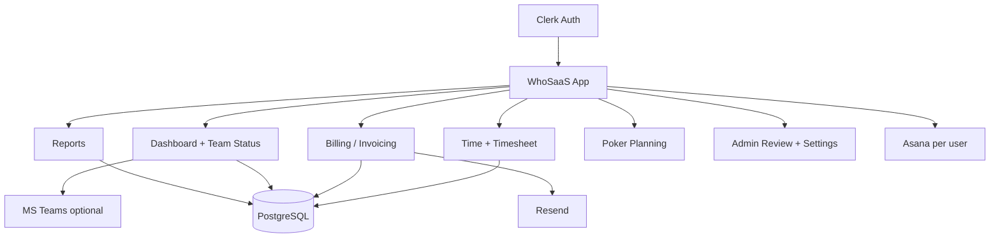

# WhoSaaS project context

Condensed from prior agent chats and codebase. Read when unfamiliar with an area.

## Product

**WhoSaaS** (`https://whosaas.com`): Asana-first multi-tenant time tracking. Tagline: *Log time once. Connect everywhere.*

| Layer | Stack |
|-------|--------|
| Frontend | Next.js 16 App Router, React, Tailwind |
| Auth | Clerk (per-user OAuth, roles) |
| DB | PostgreSQL + Drizzle ORM |
| Deploy | Vercel, Neon/Vercel Postgres |
| Email | Resend (`whosaas.com` sending domain) |
| PM integrations | Asana (MVP), Jira & Monday (partial/gated) |

## Roles and tenancy

- **`user`**: own time, timesheet, billing profile, team status actions
- **`company_admin`**: company settings, billing settings for their company, admin review
- **`super_admin`**: cross-company access (`bryan@eastendwebsolutions.com` pattern)

All data is scoped by `company_id`. Workspace dropdowns group by Asana/reporting workspace for UI; **backend auth still uses company_id**. Do not replace company scoping with workspace filters without explicit security review.

## Route map

```
src/app/(app)/
  dashboard/           Team status feed, widgets
  time/                Quick entry + timer
  timesheet/           Weekly view + archive
  billing/             user-settings, invoicing (redirect from /billing)
  reports/             Retrospective productivity, developer effectiveness
  poker-planning/      Sessions, history, settings
  admin/               Review, billing settings/submissions, timesheet detail
  settings/            Profile, integrations, company
```

Key APIs live under `src/app/api/` mirroring these domains.

## Schema areas (`src/lib/db/schema.ts`)

| Area | Tables / enums (representative) |
|------|-------------------------------|
| Core | `companies`, `users`, `projects`, `tasks`, `time_entries`, `timesheets` |
| Billing | `billing_settings`, `billing_periods`, `billing_submissions`, `billing_submission_files`, user billing profile fields |
| Team status | `team_status_events`, company Teams channel config on `company_settings` |
| Poker | poker session/story/vote tables |
| Reporting | `reporting_workspaces`, retrospective / effectiveness rollups |
| Integrations | Asana/Jira/Monday connection fields, sync runs |

## Integrations

- **Asana**: per-user OAuth; sync uses that user's token only; tasks assigned to user
- **Resend**: billing emails, team status Teams channel (email delivery method)
- **Teams channel**: channel email (`@amer.teams.ms`, `@thread.tacv2.teams.ms`) or workflow webhook; `TEAMS_EMAIL_DELIVERY_NOTE` when Resend accepts but Posts empty
- **Jira / Monday**: env-gated (`JIRA_FEATURE_ENABLED`, `MONDAY_FEATURE_ENABLED`); readiness checks should not load full `getEnv()` if optional vars are invalid

## Timezones

- **Billing weeks**: Saturday through Friday, **America/New_York**
- **Team status**: Eastern boundaries for "today" / "yesterday" feed grouping
- Store timestamps in UTC; compute period labels in ET

## Feature history (by chat)

| Feature | Chat UUID (short) |
|---------|-------------------|
| MVP foundation | `6d9511c1` |
| Audit trail | `c21221db` |
| Poker planning | `3442a3b5` |
| User dashboard | `5007f54c` |
| Team status + Teams | `53a054b0`, `e450d4a0` |
| Retrospective report | `7e9e185e` |
| AI developer effectiveness | `bdc0bf97` |
| Asana token / timezone fixes | `d26d61f4` |
| Billing / invoicing | `9ecb2074` (see billing-handoff.md) |
| Domain whosaas.com | `b4e6e478` |
| Workspace setup / skills | `dd2f0d99` |

## Known open items (from chats)

- Merge `cursor/workspace-scoped-company-filters` into `main` when ready
- Workspace-scoped company dropdown deduplication (some duplicates may persist)
- Admin timesheet detail: task names (user weekly timesheet has Task column)
- README "next steps": audit logs, stricter RLS, richer admin UX

## Mental model



## Key service paths

- `src/lib/services/billing/` — periods, submissions, invoice, email
- `src/lib/services/team-status/` — workday state, Teams notify, channel validation
- `src/lib/services/workspace-options.ts` — workspace dropdown grouping
- `src/lib/auth/rbac.ts`, `current-user.ts` — permissions
- `src/lib/env.ts` — env parsing; optional emails must not crash app
